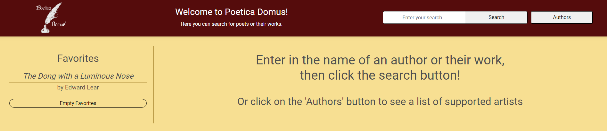
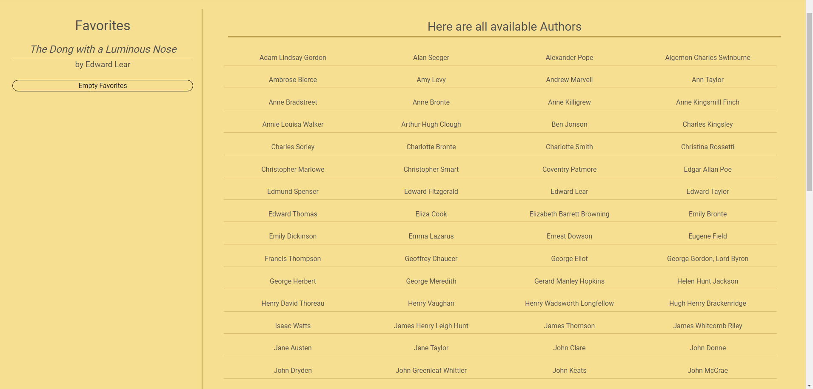
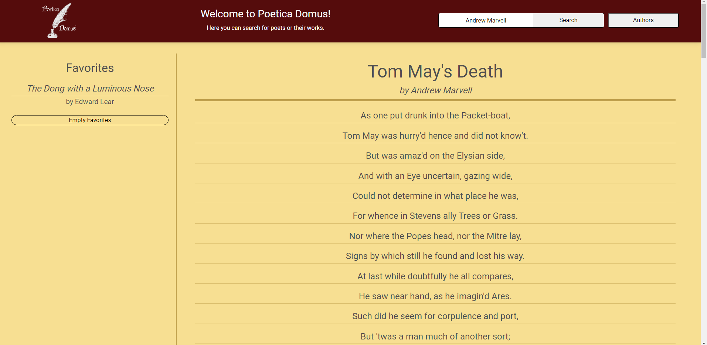
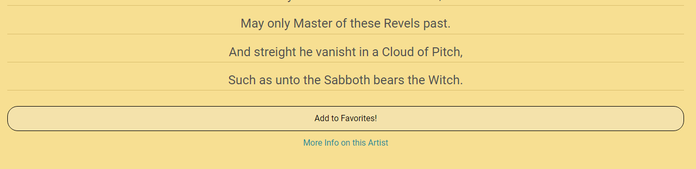
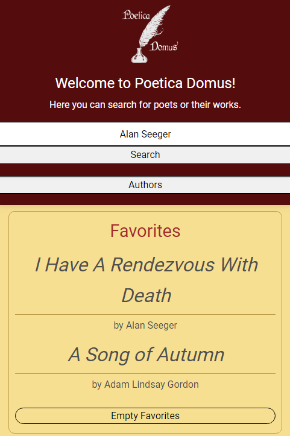

# POETICA DOMUS - RE/UP

## Description

Poetica Domus is a poetry searching site that allows users to search for famous poets, their works, and information the artist utilizing the PoetryDB and MediaWiki apis. The site is fully functional on mobile devices and utilizes a dynamic layout.

## Installation

N/A

## Usage

The page can be found online through the following github pages link: https://mattmrob.github.io/Poetica-Domus-Re/

From the home page, users can use the search bar, view their favorites, and click the author list button.

When clicking the author list button, a list of authors supported by PoetryDB will be listed to the page. These are the artists that can be searched for using the search bar.

Users can enter the name of a supported poet, or the name of a famous work into the search bar. When hitting enter or clicking the search button, a result will be displayed to the page. In the above image, you see a search for "Andrew Maxwell" has displayed a collection of his works onto the page. These works are then clickable and will load that poem to the page.

Either through clicking on a displayed poem title, or searching for it specifically, the poem is loaded to the page with the poem name, author, and lines. Each poem line is seperated by an underline, with multiple underlines representing blank spaces.

Once a poem is generated, at the bottom of the page the user can click on the favorites button to add it to their favorites list. The favorites list has a maximum of 10 items, and can be emptied by clicking on the Empty Favorites button. Users can also click on the "More Information" link at the bottom of the page to open a wikipedia article on that artist.

On mobile, the layout looks as above. The favorites list then becomes a dropdown that can be clicked to hide or display your favorites.

## Credits

jquery search on keypress from user Ian Roke at https://stackoverflow.com/questions/979662/how-can-i-detect-pressing-enter-on-the-keyboard-using-jquery

solution for replacing blank spaces using split and join: https://www.geeksforgeeks.org/how-to-remove-spaces-from-a-string-using-javascript/

solution to replacing spaces with a specific string: http://dotnet-concept.com/Tips/2015/3/5798821/How-to-replace-Space-with-Dash-or-Underscore-in-JQuery

solution for added event listeners to dynamically generated js elements using jquery: Berkeley Bootcamp TA Team

## License

MIT License